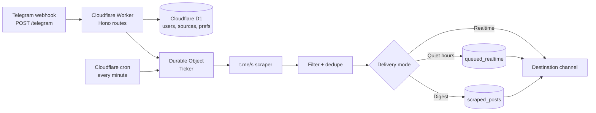

<p align="center">
  
</p>

<h1 align="center">TG Feed Bot</h1>

<p align="center">
  Mirror public Telegram channel posts into your own destination channel with realtime delivery, digest summaries, filters, quiet hours, and a bilingual Telegram UI.
</p>

<p align="center">
  
  
  
  
  
</p>

---

## ✨ What it does

**TG Feed Bot** watches public Telegram channels via `t.me/s/<channel>`, detects new posts, and republishes them into a verified destination channel. Each user can manage their own destination, followed channels, delivery mode, filters, quiet hours, and display preferences from inside Telegram.

The bot is designed to run serverlessly on **Cloudflare Workers**, using **Durable Objects** for the high-frequency ticker and **D1** for persistent state.

---

## 🧭 Table of contents

- [Highlights](#-highlights)
- [How it works](#-how-it-works)
- [Tech stack](#-tech-stack)
- [Quick start](#-quick-start)
- [Configuration](#-configuration)
- [Local development](#-local-development)
- [Deploy](#-deploy)
- [Telegram setup](#-telegram-setup)
- [Bot commands](#-bot-commands)
- [Admin endpoints](#-admin-endpoints)
- [Project structure](#-project-structure)
- [Documentation](#-documentation)
- [Limitations](#-limitations)
- [Security](#-security)

---

## 🚀 Highlights

| Area | Capability |
|---|---|
| ⚡ Delivery | Realtime mirroring, digest summaries, quiet-hours queueing, duplicate protection |
| 🎯 Destination setup | One-time `DEST <token>` claim flow for verified destination channels |
| 🔎 Filtering | Per-channel and global include/exclude keyword filters |
| 🧾 Content style | Rich or compact post style, quoted or plain full-text rendering |
| 👥 Multi-user | Isolated destinations, subscriptions, preferences, and conversation state |
| 🌐 Input formats | `@username`, `https://t.me/username`, batch imports, and forwarded channel messages |
| 🛠 Operations | Admin dashboard, JSON stats, manual scrape trigger, ticker controls |
| 🌍 UI language | Persian (`fa`) and English (`en`) bot menus and command descriptions |

---

## 🏗 How it works



### Runtime flow

1. Telegram sends bot updates to `POST /telegram`.
2. The Worker handles private messages, inline callbacks, and channel posts.
3. A Durable Object ticker runs every 5 seconds after it is started.
4. The ticker scrapes due public channels from `https://t.me/s/<username>`.
5. New posts are stored when enabled, filtered, deduplicated, and delivered.
6. Quiet-hour posts are queued and flushed after the quiet window.
7. Digest users receive summary messages on their configured interval.

---

## 🧱 Tech stack

- **Cloudflare Workers** for the HTTP bot runtime
- **Hono** for routing
- **Cloudflare Durable Objects** for the global ticker/alarm loop
- **Cloudflare D1** for SQLite-backed persistence
- **Telegram Bot API** for bot commands, messages, webhooks, and channel delivery
- **TypeScript** with `tsx`, `wrangler`, and `pnpm`

---

## ⚡ Quick start

### 1. Install dependencies

```bash
pnpm install
```

### 2. Create local environment variables

```bash
cp .dev.example.vars .dev.vars
```

Edit `.dev.vars`:

```env
BOT_TOKEN=<telegram_bot_token>
WEBHOOK_SECRET=<random_webhook_secret>
ADMIN_KEY=<optional_admin_key>
STORE_SCRAPED_POSTS=true
```

### 3. Configure Cloudflare bindings

```bash
cp wrangler.example.toml wrangler.toml
```

Create a D1 database and copy its ID into `wrangler.toml`:

```bash
pnpm exec wrangler d1 create tg_feed_bot
```

### 4. Initialize the local database

```bash
pnpm exec wrangler d1 execute tg_feed_bot --local --file=schema.sql
```

### 5. Start the Worker locally

```bash
pnpm run dev
```

### 6. In another terminal, bridge Telegram polling to local Worker

```bash
pnpm run poll
```

Now open your bot in Telegram and send `/start`.

---

## ⚙️ Configuration

### Cloudflare bindings

`wrangler.toml` must include:

| Binding | Type | Used for |
|---|---|---|
| `DB` | D1 database | Users, destinations, sources, preferences, deliveries, queues |
| `TICKER` | Durable Object | High-frequency scrape loop and ticker controls |
| Cron trigger | `*/1 * * * *` | Keeps the ticker alive; the actual scrape loop runs by DO alarm |

### Environment variables

| Variable | Required | Default | Description |
|---|---:|---|---|
| `BOT_TOKEN` | Yes | — | Telegram Bot API token from BotFather |
| `WEBHOOK_SECRET` | Yes | — | Shared secret checked on `POST /telegram` |
| `ADMIN_KEY` | No | `WEBHOOK_SECRET` | Admin API/dashboard key |
| `STORE_SCRAPED_POSTS` | No | disabled | Set `true`, `1`, or `yes` to store scraped posts for digest/backfill/queue rendering |

### Branding constants

Update these when running your own bot or channel brand:

```ts
// src/telegram/postLinks.ts
export const MAIN_CHANNEL_USERNAME = "uniflyio";
export const BOT_USERNAME = "unifly_io_bot";
```

More details: [Configuration Guide](./docs/CONFIGURATION.md)

---

## 🧑‍💻 Local development

Run the Worker:

```bash
pnpm run dev
```

Run Telegram polling bridge:

```bash
pnpm run poll
```

Optionally simulate scheduled ticks locally:

```bash
pnpm run schedule
```

Useful local database commands:

```bash
# Initialize schema
pnpm exec wrangler d1 execute tg_feed_bot --local --file=schema.sql

# Wipe runtime data but keep tables
pnpm exec wrangler d1 execute tg_feed_bot --local --file=wipe.sql
```

More details: [Development Guide](./docs/DEVELOPMENT.md)

---

## ☁️ Deploy

### 1. Initialize remote D1 schema

```bash
pnpm exec wrangler d1 execute tg_feed_bot --remote --file=schema.sql
```

### 2. Add Worker secrets

```bash
pnpm exec wrangler secret put BOT_TOKEN
pnpm exec wrangler secret put WEBHOOK_SECRET
pnpm exec wrangler secret put ADMIN_KEY
pnpm exec wrangler secret put STORE_SCRAPED_POSTS
```

For `STORE_SCRAPED_POSTS`, enter `true` if you want digest mode to work.

### 3. Deploy

```bash
pnpm exec wrangler deploy
```

More details: [Deployment Guide](./docs/DEPLOYMENT.md)

---

## 🤖 Telegram setup

### Register the production webhook

```bash
curl -sS "https://api.telegram.org/bot<BOT_TOKEN>/setWebhook" \
  -H "Content-Type: application/json" \
  -d '{
    "url": "https://<your-worker-domain>/telegram",
    "secret_token": "<WEBHOOK_SECRET>",
    "drop_pending_updates": true
  }'
```

### Verify webhook status

```bash
curl -sS "https://api.telegram.org/bot<BOT_TOKEN>/getWebhookInfo"
```

### Destination channel setup

1. Create or choose a destination Telegram channel.
2. Add the bot as an admin with permission to post messages.
3. Send `/newdest` to the bot.
4. Copy or forward the generated `DEST <token>` line into the destination channel.
5. The bot verifies the channel and links it to your account.

---

## ⌨️ Bot commands

| Command | Purpose |
|---|---|
| `/start` | Open the setup wizard or home menu |
| `/help` | Show user help |
| `/commands` | Show command list |
| `/newdest` | Set a destination channel |
| `/changedest` | Replace the current destination channel |
| `/follow` | Follow one or more public channels |
| `/import` | Bulk import channels |
| `/list` | View and manage followed channels |
| `/settings` | Open global settings |
| `/cancel` | Cancel the current conversation step |
| `/done` | Exit batch-add flow |

More details: [Bot Usage Guide](./docs/BOT_USAGE.md)

---

## 🔐 Admin endpoints

Admin routes accept any of these auth methods:

- `Authorization: Bearer <ADMIN_KEY>`
- `X-Admin-Key: <ADMIN_KEY>`
- `?key=<ADMIN_KEY>`

| Method | Path | Description |
|---|---|---|
| `GET` | `/admin/stats` | HTML operations dashboard |
| `GET` | `/admin/stats.json` | JSON stats payload |
| `POST` | `/admin/run-scrape` | Trigger one scrape cycle |
| `POST` | `/admin/ticker/start` | Ensure the ticker alarm is running |
| `POST` | `/admin/ticker/stop` | Stop the ticker alarm |
| `GET` | `/admin/ticker/status` | Return ticker alarm state |

Example:

```bash
curl -sS "https://<your-worker-domain>/admin/stats.json" \
  -H "Authorization: Bearer <ADMIN_KEY>"
```

More details: [Operations Guide](./docs/OPERATIONS.md)

---

## 📁 Project structure

```text
.
├── docs/                       # Expanded documentation
├── migrations/                 # Incremental SQL migrations
├── public/                     # Brand and example visual assets
├── scripts/
│   ├── poll.ts                 # Local Telegram getUpdates bridge
│   └── schedule.ts             # Local scheduled-trigger simulator
├── src/
│   ├── admin/stats.ts          # Admin dashboard and metrics
│   ├── db/repo.ts              # D1 repository helpers
│   ├── db/schema.ts            # Runtime schema upgrades
│   ├── scraper/tme.ts          # t.me/s scraper and media extraction
│   ├── telegram/               # Telegram client, commands, handlers, UI
│   ├── ticker/do.ts            # Durable Object scrape/delivery loop
│   ├── config.ts               # Environment helpers
│   ├── index.ts                # Worker entrypoint and routes
│   └── types.ts                # Shared TypeScript types
├── schema.sql                  # Base schema for new databases
├── wipe.sql                    # Data wipe script, keeps schema
├── wrangler.example.toml       # Cloudflare Worker template
└── .dev.example.vars           # Local env template
```

---

## 📚 Documentation

| Guide | What is inside |
|---|---|
| [Getting Started](./docs/GETTING_STARTED.md) | Fast setup checklist from clone to first delivery |
| [Configuration](./docs/CONFIGURATION.md) | Environment variables, bindings, constants, secrets |
| [Deployment](./docs/DEPLOYMENT.md) | Cloudflare deploy and Telegram webhook setup |
| [Bot Usage](./docs/BOT_USAGE.md) | Commands, destination flow, follow/import flow, filters |
| [Architecture](./docs/ARCHITECTURE.md) | Worker, Durable Object ticker, D1, scraper, delivery strategy |
| [Database](./docs/DATABASE.md) | Tables, schema initialization, migrations, wipe flow |
| [Operations](./docs/OPERATIONS.md) | Admin endpoints, monitoring, queues, maintenance |
| [Troubleshooting](./docs/TROUBLESHOOTING.md) | Common problems and fixes |
| [Development](./docs/DEVELOPMENT.md) | Local workflow, scripts, code map, safe changes |

---

## ⚠️ Limitations

- Only **public** Telegram channels can be scraped.
- Scraping relies on Telegram’s public `t.me/s` preview pages, so page structure changes can require scraper updates.
- Filters use case-insensitive substring matching, not regular expressions.
- Quiet hours are evaluated in **UTC**.
- The project currently has no automated test suite.
- Digest mode requires `STORE_SCRAPED_POSTS=true`.

---

## 🔒 Security

Never commit real Telegram tokens, webhook secrets, admin keys, or Cloudflare IDs. Use `.dev.vars` locally and `wrangler secret put` for production.

See [SECURITY.md](./SECURITY.md) for reporting and operational guidance.

---

## 📄 License

ISC
