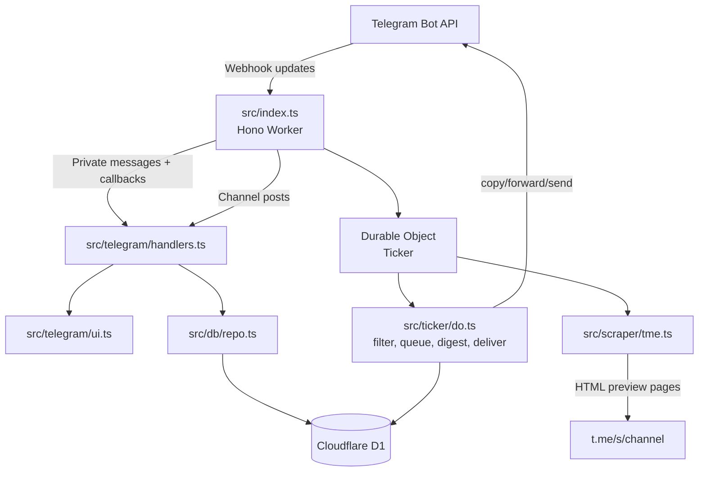

# Architecture

UniflyIO is a serverless Telegram mirroring service built on Cloudflare Workers, Durable Objects, and D1.

## Component map



## Main runtime routes

Defined in `src/index.ts`.

| Route | Purpose |
|---|---|
| `GET /` | Health check returning `ok` |
| `POST /telegram` | Telegram webhook receiver |
| `GET /admin/stats` | HTML admin dashboard |
| `GET /admin/stats.json` | JSON stats payload |
| `POST /admin/run-scrape` | Trigger one scrape loop |
| `POST /admin/ticker/start` | Start Durable Object alarm |
| `POST /admin/ticker/stop` | Stop Durable Object alarm |
| `GET /admin/ticker/status` | Read Durable Object alarm status |

## Update processing

`processUpdate()` handles three update kinds:

1. `callback_query` → inline button actions
2. private `message` → commands and conversation state
3. `channel_post` → destination claim verification

Before handling an update, it ensures:

- database upgrades are applied with `ensureDbUpgrades()`
- Telegram command menus are registered with `ensureBotCommands()`

## Ticker lifecycle

The ticker is a global Durable Object named `global`.

- Cloudflare cron runs every minute and calls `ensureTickerStarted()`.
- The Durable Object alarm runs the actual loop every 5 seconds.
- A DO storage lock prevents overlapping scrape cycles.
- The scrape loop can also be triggered manually through `/admin/run-scrape`.

## Scraping model

The scraper reads public Telegram preview pages:

```text
https://t.me/s/<username>
```

`src/scraper/tme.ts` extracts:

- numeric post ID
- plain text content
- canonical post link
- media URLs where available
- location-like payloads where recognizable
- native-only media hints for source copy fallback

The scraper uses Cloudflare cache for preview requests with a short cache TTL.

## Source scheduling

Each source has scheduling fields in the `sources` table:

| Field | Meaning |
|---|---|
| `last_post_id` | Highest processed post ID |
| `next_check_at` | Next due scrape time |
| `check_every_sec` | Adaptive interval |
| `fail_count` | Consecutive scrape failures |
| `last_error` | Last scrape error text |
| `last_success_at` | Last successful scrape time |

The ticker processes due sources in batches and uses adaptive backoff:

- new posts found → faster polling
- no new posts → slower polling up to the maximum
- failures → exponential backoff up to the maximum

## Filtering and delivery

For each new post, the bot evaluates:

1. destination exists and is verified
2. user/global realtime state
3. per-channel pause state
4. per-channel and global exclude filters
5. per-channel and global include filters
6. quiet hours
7. delivery deduplication

The `deliveries` table prevents sending the same `(user_id, username, post_id)` more than once.

## Delivery strategy

For Telegram delivery, the bot tries increasingly broad fallbacks:

1. `copyMessage` when a source message can be copied
2. `forwardMessage`
3. direct media endpoint such as `sendPhoto`, `sendVideo`, `sendDocument`, `sendLocation`
4. text fallback with the original link

This keeps fidelity high where Telegram allows it while still delivering readable fallback content.

## Digest model

Digest mode groups stored posts by user and source. It requires:

```env
STORE_SCRAPED_POSTS=true
```

Digest intervals are controlled by each user’s `digest_hours` and `last_digest_at` preference fields.

## Quiet-hours queue

When quiet hours are active, realtime delivery records are inserted into `queued_realtime` instead of being sent immediately. The ticker flushes queued posts after the quiet window, respecting destination and delivery dedupe rules.
